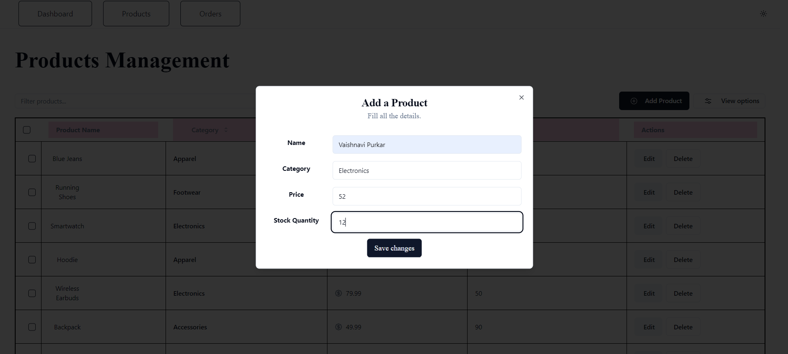

# Simplified ERP System with React

Welcome to the Simplified ERP System with React! This project provides a user-friendly interface for managing essential business operations. Whether you're handling product listings or managing orders, this application simplifies the process, all while offering a seamless user experience.

## Features:

### Dashboard:
- Provides an overview of key metrics and features.
- Quick navigation links to Products and Orders management pages.

### Products Management:
- Displays a list of products with details such as name, category, price, and stock quantity.
- Allows for adding, editing, and deleting products.

### Orders Management:
- Presents a list of orders including order ID, customer name, order date, and status.
- Optional features include viewing order details, updating order status, and deletion of orders.

### Orders Calendar View (Optional):
- Displays orders on their expected delivery dates using a calendar interface.
- Provides the ability to view orders due for delivery on a specific day by clicking on the date.

## Technology Stack:
- React: A JavaScript library for building user interfaces.
- React Router: For managing navigation within the application.
- Bootstrap (optional): For responsive design components.

## Getting Started:

Follow these steps to get the project up and running on your local machine:

1. Clone the repository:

Certainly! Let's enhance the README with some additional sections and visual elements to make it more attractive:

markdown
Copy code
# Simplified ERP System with React

Welcome to the Simplified ERP System with React! This project provides a user-friendly interface for managing essential business operations. Whether you're handling product listings or managing orders, this application simplifies the process, all while offering a seamless user experience.

## Features:

### Dashboard:
- Provides an overview of key metrics and features.
- Quick navigation links to Products and Orders management pages.

### Products Management:
- Displays a list of products with details such as name, category, price, and stock quantity.
- Allows for adding, editing, and deleting products.

### Orders Management:
- Presents a list of orders including order ID, customer name, order date, and status.
- Optional features include viewing order details, updating order status, and deletion of orders.

### Orders Calendar View
- Displays orders on their expected delivery dates using a calendar interface.
- Provides the ability to view orders due for delivery on a specific day by clicking on the date.

## Technology Stack:
- React: A JavaScript library for building user interfaces.
- React Router: For managing navigation within the application.
- Bootstrap (optional): For responsive design components.

## Getting Started:

Follow these steps to get the project up and running on your local machine:

1. Clone the repository:

git clone <repository-url>

2. Navigate to the project directory:

cd simplified-erp-system-react

3. Install dependencies:

npm install

4. Start the development server:

npm start

5. Open your browser and visit http://localhost:3000 to view the application.

## Screenshots:

### Dashboard

### Products Management

### Add product

### Edit product

### View product

### Orders Management

### Orders Calendar View

### Add order

### Edit order

### Filter by status

### View order

